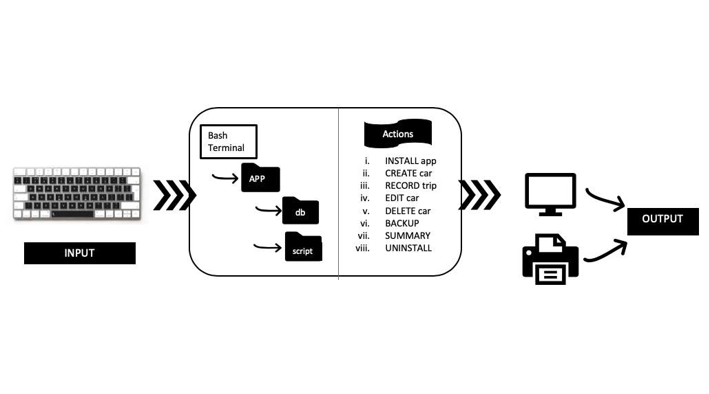
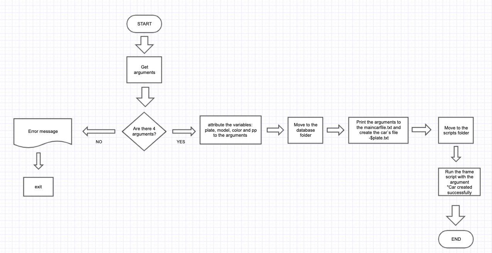
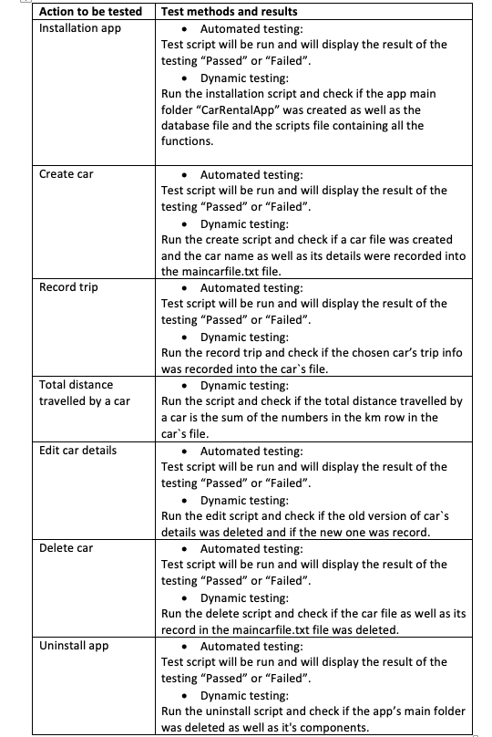
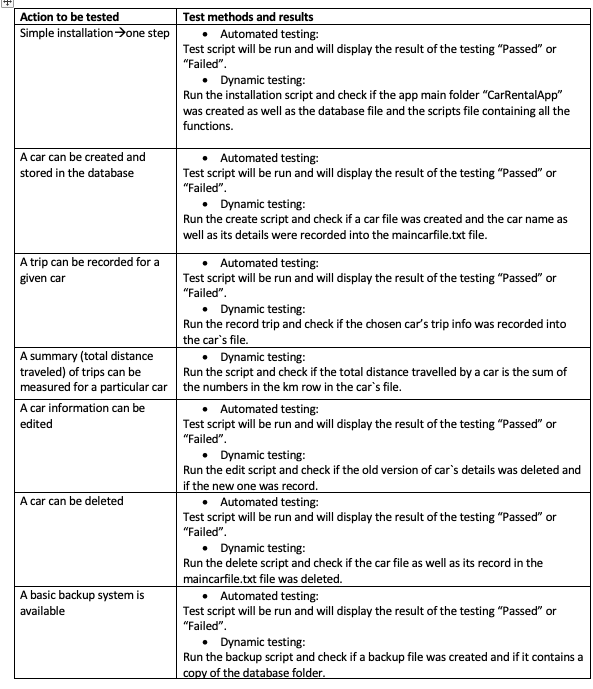
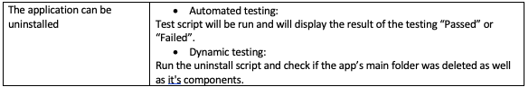

Car Rental Minimal App
===========================

A car rental management minimal app in Bash.

Contents
-----------------------

 <details><summary>Planning</summary>

Definition of the problem
=========================
My client, Mr. xx is an onwer of a car rental bussiness. His company has a range of cars availbale for rent on a price that varies on the hours of use. The owner requests a computer program for recording information about their orders with the purpose of collecting basic information about the distance driven for each car and points out specific features: easy commands to allow to create a car, record a trip distance, query the trip history a car, edit, delete a car and see the total statistics. One more requirement of the client was a simple terminal based program with a simple and transparent installation. Theres no reference to prior experience with a computer system program. 

Proposed Solution
=====================
Since we dont know about any prior experience of the stakeholders with a computer system, we have to follow all the requirements given by the client entirely and successfully because we assume they must be according the stakeholders capacities and the technology available in the company. To make the installation easy and clear, its necessary to use a software system that already has the chosen terminal to reduce the work of going through its instalation, which would make the process of installing the app less simple and longer. I chose to work on bash because I am familiar with it, its a free software that can be found in most operating systems except the WINDOWS based. These include a lot of Linux distributions, macOS, iOS, Android, among others. It can generate txt files and has the man page feature. 
Git Hub was used to record all the steps in the process of creating the Car Rental App. This helped in the organization and  keeping on track on what was done and what needed to be done. 
 
Sucess Criteria
===================
These are the measurable outcomes :

1. A car can be created and stored in the database
1. A trip can be recorded for a given car
1. A summary (total distance traveled) of trips can be measured for a particular car
1. A car information can be edited
1. A basic backup system is available
1. Installation is simple-> it does not require additional software, one step process
1. A car can be deleted
1. The application can be uninstalled 
 <p></details>
 

 <details><summary>Design</summary>
  
System diagram
=======================
 To design the system diagram of the car rental app we followed the requirements of the client for the desirable outcomes. 
 The input of data will be made through a bash terminal using the scripts that we will be uploaded together with the Car Rental App through installation. The data will be directed to the database file that is also within the Car Rental App folder.
 Our scripts comprehend 8 actions that will be afterwards explained in the development section: create, record, edit,delete, summary, backup and uninstall.
 
 
  
 [Fig1][This picture shows the system diagram for the car rental program]


Algorithms flow diagram
==========================
Some flowcharts of the program's functions: 

Create function flowchart 
----------------

[fig2][This picture shows the flowchart of the create function]

Record function flowchart
-----------

[fig3][This picture shows the flowchart of the record function]

Edit function flowchart
-----------

[fig4][This picture shows the flowchart of the edit function]


Test plan
================


  
Test 1 : Installation
---------------
``.sh
#!/bin/bash

cd ~/Desktop/CarApp
bash install

echo " TESTING.... "
#check if the Car Rental file and its componets exists
if [ -d ~/Desktop/CarRentalApp/database ]; then
  echo "Car Rental App and database was created..."
else 
   echo "Car Rental App or databse not created"
   echo " Test 1: one step installation -- Failed "
   exit
fi
 
  if [ -d ~/Desktop/CarRentalApp/scripts ]; then
  echo "...scripts file was created."
else 
  echo "...scripts file not created"
  echo " Test 1: one step installation -- Failed "
  exit
  fi

    if [ -f ~/Desktop/CarRentalApp/scripts/create ]; then 
     if [ -f ~/Desktop/CarRentalApp/scripts/record ]; then
      if [ -f ~/Desktop/CarRentalApp/scripts/edit ]; then
       if [ -f ~/Desktop/CarRentalApp/scripts/summarise ]; then
         if [ -f ~/Desktop/CarRentalApp/scripts/backup ]; then
          if [ -f ~/Desktop/CarRentalApp/scripts/delete ]; then
           if [ -f ~/Desktop/CarRentalApp/scripts/frame1.sh ]; then
            if [ -f ~/Desktop/CarRentalApp/scripts/unistall ]; then
                echo " All scripts were copied "
		echo "Test 1: One step installation -- Passed"
            fi
           fi
          fi
         fi
       fi
      fi
     fi
    else
    echo "...scripts are not complete"
    echo " Test 1: one step installation -- Failed "
    exit 
    fi
``
[Fig5][The above script shows the algorithms for Test 1]
 
Test 2 : Create car
---------------
```.sh
#!/bin/bash

#step 1: create a car using the script create
cd ~/Desktop/CarRentalApp/scripts
bash create TXM301 nissan red 9

Echo "TESTING..."
#step 2: check that the license file .txt was created 
if [ -f "../database/TXM301.txt" ] ; then
echo "A car file was created inside the database"
else 
echo "Car file was not found."
echo "Test 2: create car -- Failed"
exit
fi

#step 3: check that the car was added to the main file
lastline=$( tail -n 1 ../database/maincarfile.txt )
if [ "TXM301 nissan red 9" == "$lastline" ]; then 
	echo "The car details were recorded into maincarfile.txt"
        echo "Test 2: create car -- Passed"
else
	echo "Car details were not recorded into maincarfile.txt"
	echo "Test 2: create car -- Failed"
fi

```
[Fig6][The above script shows the algorithms for Test 2]

Test 3: Record trip
--------------
```.sh
#!/bin/bash

cd ~/Desktop/CarRentalApp/scripts
bash record TXM301 20 4 4 

#step 2: check that the trip info was recorded
lastline=$( tail -n 1 ../database/TXM301.txt ) 
if [ "20 4 4" == "$lastline" ] ; then
	echo "The car's trip info was recorded into the car's file"
	echo "Test 3: Record trip -- Passed"
else 
	echo "The ca's trip info was not recorded into the car's file"
	echo "Test 3: Record trip -- Failed"
fi

```
[Fig7][The above script shows the algorithms for Test 3]

Test 4: Edit car
------------
``.sh
#!/bin/bash

cd ~/Desktop/CarRentalApp/scripts
bash edit TXM301 toyota blue 10 

Echo "TESTING ..."

lastline=$( tail -n 1 ../database/maincarfile.txt )

#Check that the old version was deleted
if [ "TXM301 toyota blue 10" == "$lastline" ]; then
        echo "The old version was deleted "
else
        echo "Test 4: Edit car -- Failed"
        exit
fi


if [ "TXM301 nissan red 9" != "$lastline" ]; then
	echo "The new version was recorded"
        echo "Test 4: Edit car -- Passed"
else
	echo "The new version was not recorded"
        echo "Test 4: Edit car -- Failed"
fi

``
[Fig8][The above script shows the algorithms for Test 4]

Test 5: Delete car
-------------
``.sh
#!/bin/bash

cd ~/Desktop/CarRentalApp/scripts
bash delete TXM301

#Check that the car file was deleted
if [ ! -f ../database/TXM301.txt ] ; then
	echo "The car file was deleted"
else 
	echo "Error. File not deleted."
	echo "Test 5: Delete car -- Failed"
exit
fi 

lastline=$( tail -n 1 ../database/maincarfile.txt )
if [ "TXM301 toyota blue 10" != "$lastline" ]; then
	echo "The car's details were deleted from maincarfile.txt"
        echo "Test 5: Delete car -- Passed"
else
	echo " The car's details were not deleted from maincarfile.txt"     
	echo "Test 5: Delete car -- Failed"
fi

``
[Fig9][The above script shows the algorithms for Test 5]
<p></details> 


<details><summary>Development</summary>
  
Installation
====================

The installation function creates the app's main folder and its components: database folder and scripts folder.

```.sh
#!/bin/bash

#This file creates the folder structure for the
#minimal car rental app 

echo "Starting installation"

#Moving to the desired directory
cd ~/Desktop

#Creating the App folder 
mkdir CarRentalApp

#moving to the App folder
cd CarRentalApp

#Creating folders for the database and the script 
mkdir database  

cp -r ~/Desktop/CarApp/scripts ~/Desktop/CarRentalApp/
echo "Installation completed sucessfully"
```
[Fig10][The above script shows the algorithms for installing the app]
The following steps summarize the algorithms to create a new car in the system:
1. Move to the desktop
1. Create the CarRentalApp file
1. move to the CarRentalApp 
1. create the database folder
1. copy the scripts folder from the CarApp file (installation file)

problems and solutions
----------------------
In the first draft of the script, the user had to add the location for the installation of the app but since we dont know if the user knows how to write paths, I had to set a location and I chose desktop because its the most acessible location.
The first draft also did not have the feature of creating a scripts file containing all the application's funtions. This was solved by creating an installation folder that contained the all scripts inside a folder and adding a section the installation script to copy this folder to the app's main folder.


Creat
==================
  
The create function creates a car file and records the car's details in the maincarfile.txt file.

```.sh
#!/bin/bash
 
#This program creates a car and record the orders of a car rental bussiness 

#Create a car
#Check number of arguments
if [ $# -ne 4 ]; then
echo " Incomplete input. Please enter Plate, Model, Colour and PP "
exit

else
 
#If number of arguments is correct. Continue
plate=$1
model=$2
color=$3
pp=$4

#Record order
#moving to the directory where we can find the db file inside the RentalCarApp
#folder. Now we are inside the scripts file, so we will move one level up.
cd ../database

#Adding new entry to the file maincarfile.txt without erasing.
echo "$plate $model $color $pp" >> maincarfile.txt
#creating 
echo " " > $plate.txt

cd ../scripts
#presenting the results in a frame
bash frame1.sh "Car Created successfully"

fi
```
[Fig11][This script shows the algorithms for creating the car]

The following steps summarize the algorithms to create a new car in the system:
1. Get input from the user 
1. Check number of arguments (model, color, pp). If 4 then continue, if not "message", exit. 
1. Write to main file with one extra line. Not erasing other entries. 
1. Create car trip file with 4 case for the 4 arguments plate.txt

problems and solutions: 
-----------------
The frame was not showing. This was solved by specfiying the location of the frame script.


Record
==========================
The record function stores a car's trip information in the car's file.
 
```.sh 
#!/bin/bash

#Check if arguments are complete
if [ $# -ne 4 ]; then
echo " The arguments are not complete. Enter Plate, Km, Date-out and Date-in "
exit 
fi

plate=$1
km=$2
dateout=$3
datein=$4

cd ../database
if [ ! -f $plate.txt ]; then
echo "This car was not created"
exit
else 
echo "$km $dateout $datein" >> $plate.txt
fi

cd ../scripts
bash frame1.sh "Trip info recorded successfully" 
```
[Fig][This script shows the algorith for recording a car trip]
The following steps summarize the algorithms to record trip info:  
1. Check arguments (Plate, km,Date-out,Date-in) if 4, then continue, if not "message", exit.
1. Check that the car exists.
1. If car exists then write the trip info in the $plate.txt file, without erasing previous trips.

Edit
==================
The edit function edits a car's details stored in the maincarfile.txt file.
  
```.sh
 #!/bin/bash

#This program edits the recorded information of existing car in the 
#maincarfile


#Check if the number of arguments equals to 4
if [ $# -ne 4 ]; then
echo "Error with the number of arguments"
echo "Enter License Model colour and passengers"
exit
fi


#atributing variables
plate=$1
model=$2
colour=$3
pp=$4

#moving to the database
cd ../database

#checking if car exists
if [ ! -f $plate.txt ]; then
echo "Car does not exit"
fi

#find the line and replace the wrong information with the new one
sed -i '' "/$plate/d" maincarfile.txt

#add the new information 
echo " $plate $model $colour $pp " >> maincarfile.txt

#moving to the scripts
cd ../scripts

#presenting the results
bash frame1.sh "Car edited successfully"
```
[Fig][The above script shows the algorithms to edit a car info]

The following steps summarize the algorithms to edit a car info:
1. Check the number of arguments. If not equal to 4, then print "message" and exit
1. atribute variables to the arguments
1. move to the database file to locate the car file
1. check if car file exists. If not, then print "message" and exit. Else, copy the arguments to the car file.
1. move to the script file to locate the frame script
1. show results in frame script

Problems and solutions
-----------------
The old version being replaced was not being erased. This problem was solved by adding ``.sh '' `` in the line: ``.sh sed -i '' "/$plate/d" maincarfile.txt ``

Delete 
==============
The delete function deletes a car's file and its record in the maincarfile.txt file.
  
```.sh
#!/bin/bash

#This program deletes a created car

plate=$1

#First we check the number of arguments 
if [ $# -ne 1 ]; then
echo " No input. Please restart and enter the name of the car. "
exit
fi

#move to the Car Rental App main folder
cd ../database

#Check if car exists
if [ ! -f $plate.txt ]; then
echo " This car does not exist."
exit

else

#delete car
rm $plate.txt

 
#delete line of the car in the maintext.file
sed -i '' "/$plate/d" maincarfile.txt

cd ../scripts

#showing the results
bash scripts/frame1.sh "Car deleted successfully" 

fi
 
```
[Fig][The above script shows the algorithms to delete a car]

The following steps summarize the algorithms to delete a car:
1. Check the existance and number of arguments. If not equal to one, then print "message" and exit. If yes, continue.
1. atribute a variable to the first argument
1. move to the database directory to locate the car file
1. check if car exists. If not, then print "message" and exit. Else, delete the car file and delete the car info in the main car file 
1. Show results in frame

Summary 
=============
The summary fucntion displays the total distance travelled by a car.

```.sh 
#!/bin/bash

#This script generates the summary of the car

bash frame1.sh Summary

#Check if the user inputs any argument (check number of arguments) 
if [ $# -ne 1 ]; then
echo "No argument inputed.Run the program again and enter the car license"
exit
fi


#Check if file exists in database
car=$1

#move to the desirable directory 
cd ../database

#Another option is moving to the database before checking the file
if [ ! -f $car.txt ]; then
 echo " Car not created. $car does not exist in the database "
 exit
fi

#Summary of the car 
total=0

while read line; 
do

#Show the sum of the km
for km in $line 
do 
  (( total=$total+$km ))
break
done

done < car.txt

#Step 4: Show result nicely 
cd ../scripts/
bash frame1.sh "Total distance travelled for $car was $total"
```
[Fig][The above script shows the algorithms for the backup function]

The following steps summarize the algorithms to generate the summary of a car:
1. Check the number of arguments. If 1 continue, if not "message", exit.
1. Check if the car exists. If yes continue, if not "message", exit.
1. Read the record trips in the car license and for the first word in line (km)
do summary for all if $1 arg =all

Backup
===============
The backup function creates a backup file and copies the database folder from the App main folder.
  
```.#!/bin/bash

#this program backs up the Rental Car app data into a directory chosen by the
#user

cp -a ~/Desktop/RentalCarApp/database ~/Desktop/BACKUP
echo "Successfully backed up into Desktop."

cd ../scripts
bash frame1.sh "Backup was successfully"  

```
[Fig][The above script shows the algorithms for the backup function]

The following steps summarize the algorithms to backup the data in the Car Rental App:
1. Check the existance and number of arguments. If not equal to 1 then print "message", exit, else :
   1. cope the Car Rental App into a destination input by the user
   2. change the name to one that specifies the day of the backup
   3. show the results  
   
Problems and solutions
--------------------
The first backup script as the installation script also had the option of the letting the user input the location. This was changed by setting the desktop as the default location for the same reason as of the installation script.

Uninstall
==============
This function deletes the app's main folder as well as all the components within it.
``.sh
#!/bin/bash

#Go two levels up to get to the directory where our Car Rental File was 
#installed
cd ../..

#delete the app directory
rm -r RentalCarApp

``

Man pages
================

Install
----------
``.sh
.TH man 6 "28t Oct 2019" "1.0" "Install man page"
.SH NAME
install \-install app 
.SH SYNOPSIS
bash install
.SH DESCRIPTION 
The install function creates the main folder for the app (CArRentalApp) and its components: database and scripts
.SH AUTHOR
Lingye
``
create
----------
``.sh
.TH man 6 "28t Oct 2019" "1.0" "car Rental App scripts man page"
.SH NAME
create \-create a new car 
.SH SYNOPSIS
bash create [license] [model] [color] [passengers]
.SH DESCRIPTION
The create function creates a car file and records the car's details in the maincarfile.txt file. The user needs to input 4 
arguments (car details) when running the script in the order of license, model, color and passengers.
.SH EXAMPLES
bash create LXH798 Mazda Red 3
.SH AUTHOR
Dr. Ruben Pinzon
``
record
----------
``.sh
.TH man 6 "28t Oct 2019" "1.0" "Record trip man page"
.SH NAME
record \-crecord a trip 
.SH SYNOPSIS
bash record [license] [km] [date-out] [date-in]
.SH DESCRIPTION
The record function stores a car's trip information in the car's file. The user needs to input 4 
arguments (trip info ) when running the script in the order of license km date-out and date-in.
.SH EXAMPLES
bash create LXH798 20 04.04.2019  04.05.2019
.SH AUTHOR
Dr. Ruben Pinzon
``
edit
-------
``.sh
.TH man 6 "28t Oct 2019" "1.0" "Edit a car man page"
.SH NAME
edit \-edit a car 
.SH SYNOPSIS
bash edit [license] [model] [color] [passengers]
.SH DESCRIPTION
The edit function edits a car's details stored in the maincarfile.txt file. The user needs to input 4 
arguments (new version of car details) when running the script in the order of license, model, color and passengers.
.SH EXAMPLES
bash edit LXH798 Nissan Blue 4
.SH AUTHOR
Dr. Ruben Pinzon
``
backup
-------
``.sh
.TH man 6 "28t Oct 2019" "1.0" "Backup man page"
.SH NAME
backup \- backup data 
.SH SYNOPSIS
bash backup
.SH DESCRIPTION 
The backup function creates a backup file and copies the database folder from the App main folder. The user just has to run the script using bash.
.SH AUTHOR
Lauricenia Buque 
``
summary
--------
``.sh
.TH man 6 "28t Oct 2019" "1.0" "Summary man page"
.SH NAME
summary \- summarize distance travelled
.SH SYNOPSIS
bash summary [license] 
.SH DESCRIPTION
The summary function displays the total distance travelled by a car. The user needs to input 1 
arguments (license) when running the script.
.SH EXAMPLES
bash summary LXH798 
.SH AUTHOR
Dr. Ruben Pinzon 
``
delete
-------
``.sh
.TH man 6 "28t Oct 2019" "1.0" "delete car man page"
.SH NAME
delete \-delete a new car 
.SH SYNOPSIS
bash delete [license]
.SH DESCRIPTION
The delete function deletes a car's file and its record in the maincarfile.txt file. The user needs to input 1 
arguments (license) when running the script.
.SH EXAMPLES
bash delete LXH798
.SH AUTHOR
Fuma 
``
uninstall
----------
``.sh.TH man 6 "28t Oct 2019" "1.0" "uninstall app man page"
.SH NAME
uninstall \-uninstall app 
.SH SYNOPSIS
bash uninstall
.SH DESCRIPTION
This function deletes the app's main folder as well as all the components within it. The user just has to run the script using bash.
.SH AUTHOR
Lauricenia Buque
``
<p></details>


<details><summary>Evaluation</summary>

Evidence for sucess of criteria 
==============================



Recommendations for the future
======================================
In the end the program fullfilled all the sucess criteria, however through out the development of the program, I realised that a few other features should have been added to the program: 
1. Headers for the car.txt files and for the maincarfile.txt file: For an easy understanding of the data recorded, there should be a header for each row so that we know from looking which row corresponds to what. Eg.: 
Eg.: In a car.txt file

1. A feature to edit the cars trip info: The edit function available for this app only edits the cars details however its also possible for an error to occur when inputting the car trip info, for this reason its also important to have an edit option for the trip data.

1. There should be a feature to delete specific lines in the files, not only delete car. For example, in a case where I run the create script when I wanted to run the record script, I would make the error of storing the trip data in the maincarfile.txt file and if in this case I try to solve it by running the delete function, it would delete the car and all the data related to it, and this is a big risk of loss of data. 

1. A summary of a car should have more details. The actual summary function only shows the total distance travalled by the car but there are more revelant details that would be helpfull for the business,like, how many times was the car rented, the period of the year that it was most rented, or the average amount of time that it is usually rented for. 

1. The backup should be automatic and the database versions should have a backup dates name, eg.: BACKUP/database_04.04.2019 ( this backup was done in april 4th of 2019 ). One more thing that would improve the backup function is having the option of backing up in an external drive. In a case of an accident with the computer that would be the only way to recover the data.
summary : explain what type of testing was used (refer to the slides in )

<p></details>

<details><summary>References</summary>

Christensson, Per. "Bash Definition." TechTerms. Sharpened Productions, 15 August 2013. Web. 02 November 2019. <https://techterms.com/definition/bash>.

Gite, Vivek, et al. “HowTo: Linux / UNIX Create a Manpage.” NixCraft, Vivek Gite, 16 Nov. 2017, www.cyberciti.biz/faq/linux-unix-creating-a-manpage/.

Pandey, Parul. “Basics of BASH for Beginners.” Medium, Towards Data Science, 26 July 2019, towardsdatascience.com/basics-of-bash-for-beginners-92e53a4c117a.
<p></details>
